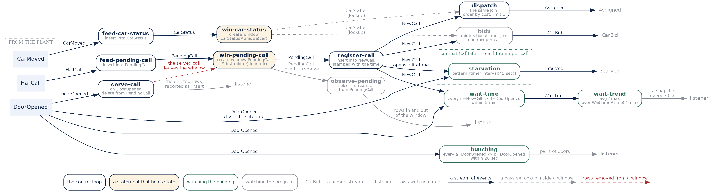

# EPL — State, lifecycles, and a complete controller

*by [Emanuele Della Valle](https://emanueledellavalle.org/) and
[Claude](https://claude.com/product/overview)*

## Introduction

The [fire alarm lecture](https://github.com/Streaming-Data-Analytics/Courseware/tree/main/Streaming%20Data%20Engineering/EPL/epl_firealarm)
closed on a question and deliberately left it hanging: **can a whole elevator controller be
written in EPL?** Not a monitoring query over a controller — the controller itself, the thing
that decides which car answers which call.

The answer is yes, and it is shorter than you expect. This module is that controller, plus
the two constructs it needs that you have not met yet: taking rows **out** of a named window,
and giving a piece of state a **lifetime**.

The order here is deliberate. The two constructs come first, in four lines each. Then the
controller arrives whole, already written. **We do not build it in class.** We run it, look
at the output, and take it apart backwards: for each row, which statement produced it, and
which lecture taught you that statement. The point is not "look how complicated this is". It
is the opposite.

## Resources

* [espertech](https://www.espertech.com)
* [EPL documentation](http://esper.espertech.com/release-9.0.0/reference-esper/html/index.html)
* [online environment to try EPL](http://esper-epl-tryout.appspot.com/epltryout/mainform.html)

## 1. Taking rows out of a named window

Last lecture a named window could be written to and read from. The third thing you can do
with one is **remove rows**, and it is the operation an inline window can never offer,
because there is no name to aim at.

```
on DoorOpened as d delete from PendingCall as p
  where p.floor = d.floor and p.dir = d.servedDir;
```

Read it as a rule rather than a query: *when a `DoorOpened` arrives, delete from
`PendingCall` every row that matches*. The triggering event is on the left, the target
window on the right.

In the controller this statement is called `serve-call`, and it is the whole of the
controller's notion of "this call has been answered".

### The trap

An `on ... delete` has an output stream of its own, and **it reports the rows it deleted as
Insert**. Every year somebody reads this as a bug. It is not: the statement's output is the
set of rows that were removed, and the tool has one word for "here are some rows".

Annex `Q.7.A5` shows it in four lines, on a trace of three events — the deletion, and the
Insert that reports it:

```
* At: 2001-01-01 08:00:02.000
   * Insert
      * PendingCall={floor=3, dir='DOWN'}
```

An Insert — of a row that has just ceased to exist. Where the removal is actually visible is
on the window itself, and on any statement watching it, which is the next section.

Keep the shape in mind. It comes back in the controller, where it is called `serve-call` and
is the whole of that controller's notion of "this call has been answered".

## 2. Seeing removals: `irstream`

A plain `select` on a named window delivers **only the insert stream**. You saw this last
lecture without a name for it: the window reported an eviction that the reader did not.

`irstream` asks for both:

```
select irstream floor, dir from PendingCall;
```

Annex `Q.7.A3` and `Q.7.A4` are the same window read both ways, at the same instant, so the
difference is a single word:

```
* At: 2001-01-01 08:00:00.000
   * Insert
      * Q.7.A3-output={floor=3, dir='DOWN'}
* At: 2001-01-01 08:00:01.000
   * Insert
      * Q.7.A3-output={floor=5, dir='UP'}
* At: 2001-01-01 08:00:05.000
   * Insert
      * Q.7.A3-output={floor=5, dir='UP'}
```

```
* At: 2001-01-01 08:00:00.000
   * Insert
      * Q.7.A4-output={floor=3, dir='DOWN'}
* At: 2001-01-01 08:00:01.000
   * Insert
      * Q.7.A4-output={floor=5, dir='UP'}
* At: 2001-01-01 08:00:02.000
   * Remove
      * Q.7.A4-output={floor=3, dir='DOWN'}
* At: 2001-01-01 08:00:05.000
   * Insert
      * Q.7.A4-output={floor=5, dir='UP'}
```

At 08:00:02 the `irstream` reader reports the removal and the plain one does not appear in
the output at all. Four events are enough. The controller shows it again, on a minute of real
traffic, in the section after the trace.
## The trace used by this module

The **full** trace — the one with two cars, a duplicate press, a service, a bunching and two
starvations. The adversarial trace of the previous lecture had one pathology per key and no
cars moving; this one is a minute in the life of a building.

Every output in this module comes from runs on the tool. The minimal examples of the annex
are their own run; the controller output is one run of the whole thing.

## The domain

Floors 0 to 9, two cars, A and B, as before. Three streams come in from the plant, and five
more are produced by the controller itself.

```
create schema HallCall(floor int, dir string);
create schema CarMoved(car string, floor int, dir string);
create schema DoorOpened(car string, floor int, servedDir string);

create schema NewCall(floor int, dir string, ts long);
create schema CarBid(floor int, dir string, car string, cost int);
create schema Assigned(floor int, dir string, car string, cost int);
create schema Starved(floor int, dir string);
create schema WaitTime(floor int, dir string, car string, waitMs long);
```

The first three are what a real plant emits. The other five exist only because the controller
declares them — they are its vocabulary, and each one is the output of a statement you will
recognise.

### The trace

```
CarMoved={car='A', floor=2, dir='UP'}
CarMoved={car='B', floor=9, dir='IDLE'}
t=t.plus(1 seconds)
HallCall={floor=3, dir='DOWN'}
t=t.plus(2 seconds)
HallCall={floor=3, dir='DOWN'}
t=t.plus(3 seconds)
CarMoved={car='A', floor=3, dir='UP'}
DoorOpened={car='A', floor=3, servedDir='UP'}
t=t.plus(5 seconds)
HallCall={floor=5, dir='UP'}
t=t.plus(10 seconds)
CarMoved={car='B', floor=5, dir='DOWN'}
t=t.plus(5 seconds)
CarMoved={car='B', floor=3, dir='DOWN'}
DoorOpened={car='B', floor=3, servedDir='DOWN'}
t=t.plus(4 seconds)
CarMoved={car='A', floor=3, dir='DOWN'}
DoorOpened={car='A', floor=3, servedDir='DOWN'}
t=t.plus(6 seconds)
HallCall={floor=3, dir='DOWN'}
t=t.plus(50 seconds)
```

Read it once before running anything. Someone presses for down at floor 3 and presses again
two seconds later. A car opens at floor 3 but going **up**, which does not serve them. Another
call comes from floor 5. Twenty-five seconds after the first press a car finally opens going
down. Four seconds later a second car opens at the same floor, in the same direction, for
nobody. And at the end someone presses at floor 3 again.

### Assumptions

Four things the controller takes for granted and never says. They are not bugs here, but
three of them stop being true the moment the domain changes, and one of them is the reason
this controller works at all.

* **A car's direction has a third value, `IDLE`.** A hall call is UP or DOWN — a passenger
  always wants to go somewhere. A car may be going neither way, and the cost expression
  treats that case first. Nothing else in the schemas hints that the two `dir` fields, which
  look alike, do not have the same range.

* **The penalty of 100 assumes a building shorter than about 100 floors.** A car heading the
  wrong way is scored `distance + 100`, and that only outranks a well-aligned car because no
  distance in this building can reach 100 — the maximum is nine. Put the same expression in a
  150-storey tower and a badly aligned car two floors away starts beating a well-aligned car
  a hundred and twenty floors away. The number is not a weight, it is a bound, and it is a
  bound on the building.

* **The four time constants are service levels, not physics.** Forty-five seconds before a
  call counts as starved; two minutes of wait times in the trend; five minutes for a call and
  its door to be considered the same event; twenty seconds for two doors to count as
  bunching. Every one of them is somebody's decision about what is acceptable, and every one
  of them belongs in a conversation with the building manager rather than in the source.

* **`CarStatus` is only as fresh as the last `CarMoved`.** The dispatcher decides on the
  position a car last *reported*, not the position it is in. Between two `CarMoved` events the
  controller is confidently wrong, and nothing in the trace makes that visible because the
  trace reports a move whenever there is one.

## 3. The same window, on a minute of real traffic

Now that the domain is on the table, here is `observe-pending` — an `irstream` reader over
the controller's own `PendingCall` — for the whole run. It exists for exactly one reason: to
make the lifetime of a pending call visible while everything else is happening.

```
* At: 2001-01-01 08:00:01.000
   * Insert
      * observe-pending-output={floor=3, dir='DOWN'}
* At: 2001-01-01 08:00:11.000
   * Insert
      * observe-pending-output={floor=5, dir='UP'}
* At: 2001-01-01 08:00:26.000
   * Remove
      * observe-pending-output={floor=3, dir='DOWN'}
* At: 2001-01-01 08:00:36.000
   * Insert
      * observe-pending-output={floor=3, dir='DOWN'}
```

Three inserts and one remove. The call at floor 3 going down appears at 08:00:01, disappears
at 08:00:26 when a car finally opens going down, and **appears again** at 08:00:36 when
somebody presses the button once more.

Annex `Q.7.A3` and `Q.7.A4` are the same window read both ways, at the same instant, so the
difference is a single word.

Two things worth noticing in that output before moving on.

**The duplicate press is not there.** Somebody pressed at 08:00:03 and `observe-pending` says
nothing, because `PendingCall` is declared `#firstunique(floor, dir)` — the first press per
key wins and later ones never enter. Last lecture the same window declared `#unique` and the
*last* press won. That was the design decision left open, and this is the answer.

**The window re-arms.** After the row is deleted at 08:00:26, the key is free again, and the
press at 08:00:36 enters normally. `#firstunique` does not remember keys beyond the lifetime
of the row it is holding.

## 4. Giving state a lifetime: contexts

Last lecture's assignment asked for the calls that were never served, written as a left outer
join. If you did it, you found that the answer is uncomfortable: every call produces a row
with `null` on the right when it arrives, so "has a null" does not mean "was never served".

If you wrote the full outer join as well, you saw the same thing in a harder form. Most of
its null-sided rows are simply **not yet** — a match for them turns up a second or two later,
and the first row is never retracted. One pair is split by the nine-second window although
the call *was* answered, so that row says something true about your window and something
false about the lift. Out of everything it reports with a null, very little is a failure.

A join can only tell you **what the world looks like right now**. It cannot tell you that
something *failed to happen*.

That is what a context is for.

### Three ways to declare one, and why this is the one

EPL has three kinds of context, and they are not interchangeable.

* **By key** — `partition by userId from UserActionEvent`. One context per distinct value,
  lasting as long as the engine runs.
* **By start and end conditions** — bounded by events. One context per *occurrence*.
* **By time** — temporal windows, which generalise the logical window: session windows come
  from here.

We need the second, and the reason is visible in the lifetimes picture below: the
call at floor 3 going down happens **twice** in this trace, at 08:00:01 and again at
08:00:36. Partitioning by `(floor, dir)` would give one context for that key and keep it
forever. We want one lifetime per **call**, and the same key must be able to start a fresh
one every time somebody presses the button again.

```
create context CallLife
  initiated by NewCall as n
  terminated by DoorOpened(floor = n.floor, servedDir = n.dir);
```

This declares a **lifetime**, not a query. One instance of `CallLife` opens for every
`NewCall`, and each instance closes when the door that serves *that* call opens. Statements
declared `context CallLife` then run once per instance, and see only that instance's events.

So the unserved call becomes a statement about time passing inside a lifetime:

```
context CallLife
insert into Starved
select context.n.floor as floor, context.n.dir as dir
from pattern [timer:interval(45 sec)];
```

Forty-five seconds after the call, inside its own lifetime, emit. If the door opened first,
the lifetime ended and **the timer never fires**. Nothing has to check anything.

```
* At: 2001-01-01 08:00:56.000
   * Insert
      * Starved={floor=5, dir='UP'}
* At: 2001-01-01 08:01:21.000
   * Insert
      * Starved={floor=3, dir='DOWN'}
```

Two rows, and they are the two calls this building failed. The same question the join
answered as a snapshot is now answered as an **event**, with a timestamp, which is what you
would page somebody with.

### A lifetime is an interval, up to a point

Recall the three time models: **stream-only**, where only the order of arrival counts;
**absolute**, where every event carries an instant; and **interval**, where an occurrence has
a start and an end. A context instance is the third one — and unlike a window, its bounds are
fixed by the data rather than by a clock. `CallLife` opens on a call and closes on the door
that serves that call.

That resemblance is worth naming, and it is worth stopping in the right place.

A context is an interval **scope**, not an interval-stamped **event**. You cannot ask whether
the lifetime of the call at floor 3 overlaps the one at floor 5; there is no algebra between
contexts. The questions the interval model makes natural — *which meetings overlap?*, *which
last less than five minutes?* — are not questions EPL answers about its own contexts.

The sharpest evidence is in the pattern, not the context. The match of `wait-time` spans
08:00:01 to 08:00:26 — twenty-five seconds — and this is what comes out:

```
* At: 2001-01-01 08:00:26.000
   * Insert
      * WaitTime={floor=3, dir='DOWN', car='B', waitMs=25000}
```

The engine knows the span. It computes it, puts it in the payload, and then **stamps the
event with the end instant**. The interval is demoted to data; the timestamp stays a point.

So: EPL gives you intervals as a **scope** (`context`) and as a **condition**
(`timer:within`, `timer:interval`). Everything it emits stays in the absolute-time model.
That is a design decision the language made for you, and — like rule evaluation order — it is
in the implementation rather than in any document.

Worth asking before running it: *the match covers twenty-five seconds. At what timestamp does
it come out?*

### Context or window?

A window is **not** stateless, whatever the shorthand says: it holds rows, and rows are
state. The difference is whose state it is and who decides when it ends.

A window's state is anonymous and resets on a rule fixed in advance — so many seconds, so
many events. Nothing in the data has a say. A context's state is **scoped to a lifetime the
data defines**, and it persists until something ends it; statements declared inside see only
their own instance.

Put shortly: a window is a rule about how much to remember. A context is a rule about how
long something counts as one thing.

Annex `Q.7.A6` shows the mechanism on four events, including the negative half — the served
call whose timer never fires, and a timestamp where nothing at all is emitted.

Notice what the context is initiated **by**. Not `HallCall`, the raw press, but `NewCall`,
which the controller produces from `PendingCall` — that is, *after* deduplication. Wire it to
the raw stream instead and every repeated press opens its own lifetime, so one call starves
twice. The annex does exactly that, on purpose, so you can see it happen.

## 5. The controller

Everything below you have already met. `create window`, `insert into` and `unidirectional`
joins from last lecture; `->` and `where timer:within` from the pattern lecture; data windows
and `output snapshot` from the two lectures on the fire alarm; `on delete`, `irstream` and
contexts from the three sections above.

Paste it whole. Do not read it line by line yet.

```
// Elevator dispatching controller — reference module
// Verified on the EPL online tool (Esper 9.0.0): every output shown in this module
// was read off a run, never predicted.
//
// Building: floors 0..9. Two cars, A and B. Floor 0 has UP only, floor 9 DOWN only.
// This is the target artifact of this module. Do not change it without re-running the trace.

// ================= 1. EVENT TYPES =================
create schema HallCall(floor int, dir string);
create schema CarMoved(car string, floor int, dir string);
create schema DoorOpened(car string, floor int, servedDir string);
create schema NewCall(floor int, dir string, ts long);
create schema CarBid(floor int, dir string, car string, cost int);
create schema Assigned(floor int, dir string, car string, cost int);
create schema Starved(floor int, dir string);
create schema WaitTime(floor int, dir string, car string, waitMs long);

// ================= 2. STATE =================
// "last event per car": the eviction IS the update
@name('win-car-status')
create window CarStatus#unique(car) as CarMoved;

@name('feed-car-status')
insert into CarStatus select * from CarMoved;

// "first event per (floor, direction)": duplicates never enter
@name('win-pending-call')
create window PendingCall#firstunique(floor, dir) as HallCall;

@name('feed-pending-call')
insert into PendingCall select * from HallCall;

@name('observe-pending')
select irstream floor, dir from PendingCall;

// ================= 3. NEW CALL =================
@name('register-call')
insert into NewCall
select floor, dir, current_timestamp() as ts from PendingCall;

// ================= 4. COST =================
// NOTE: the expression must NOT be named 'cost', or the order-by clause below resolves
// the column alias to the declared expression and fails with a parameter count mismatch.
create expression costOf {
  (cf, cd, nf, nd) =>
    case
      when cd = 'IDLE' then Math.abs(nf - cf)
      when cd = nd and ((nd = 'UP'   and nf >= cf)
                     or (nd = 'DOWN' and nf <= cf))
           then Math.abs(nf - cf)
      else Math.abs(nf - cf) + 100
    end };

// the bids: one row per car, inspectable
@name('bids')
insert into CarBid
select n.floor as floor, n.dir as dir, c.car as car,
       costOf(c.floor, c.dir, n.floor, n.dir) as cost
from NewCall as n unidirectional inner join CarStatus as c;

// the selection policy: the only statement students rewrite in the exercises
@name('dispatch')
insert into Assigned
select n.floor as floor, n.dir as dir, c.car as car,
       costOf(c.floor, c.dir, n.floor, n.dir) as cost
from NewCall as n unidirectional inner join CarStatus as c
order by costOf(c.floor, c.dir, n.floor, n.dir) asc
limit 1;

// ================= 5. DIRECTIONAL SERVICE =================
@name('serve-call')
on DoorOpened as d delete from PendingCall as p
  where p.floor = d.floor and p.dir = d.servedDir;

// ================= 6. STARVATION =================
create context CallLife
  initiated by NewCall as n
  terminated by DoorOpened(floor = n.floor, servedDir = n.dir);

@name('starvation')
context CallLife
insert into Starved
select context.n.floor as floor, context.n.dir as dir
from pattern [timer:interval(45 sec)];

// ================= 7. FOLLOWED-BY PATTERNS =================
@name('wait-time')
insert into WaitTime
select n.floor as floor, n.dir as dir, d.car as car,
       current_timestamp() - n.ts as waitMs
from pattern [
  every n=NewCall
    -> (d=DoorOpened(floor=n.floor, servedDir=n.dir) where timer:within(5 min))
];

@name('wait-trend')
select dir,
       avg(waitMs) / 1000 as avgSec,
       max(waitMs) / 1000 as worstSec,
       count(*) as served
from WaitTime#time(2 min)
group by dir
output snapshot every 30 sec;

@name('bunching')
select a.car as firstCar, b.car as secondCar, a.floor as floor
from pattern [
  every a=DoorOpened
    -> b=DoorOpened(floor=a.floor, servedDir=a.servedDir, car != a.car)
       where timer:within(20 sec)
];
```

### How to read it

Thirteen statements is more than fits in the head at once, so here they are drawn as what
they are: **every box is a statement, every arrow is a stream**. Dashed grey means a passive
read — a statement looking inside a window without being triggered by it — and the one red
arrow is the only thing in the program that takes rows out.



Five things that picture says and the listing does not.

**An arrow carries the name of a stream, never of an event type.** What leaves
`feed-car-status` is `CarStatus`, although the rows have the `CarMoved` type: `insert into X`
names the stream `X`, while `as CarMoved` in the `create window` declares the shape of its
rows. Here the two happen to coincide, which is exactly why they are easy to confuse.

**`insert into CarStatus select * from CarMoved` is not a rename.** It is the only thing that
puts rows in the window. `create window ... as CarMoved` is a declaration of type, not a
subscription: without the feed, `CarStatus` stays empty for ever, the join in `dispatch` finds
no car, and nothing is ever assigned. The statement reads like a rename because its
destination is declared somewhere else — point it at a name no `create window` mentions and it
really becomes one, writing to a brand-new stream that holds nothing. `insert into` cannot
tell the difference; the run can. At 08:00:06 `feed-car-status` reports one Insert while
`win-car-status` reports an Insert **and** a Remove, and both are right: the feed sends a row,
and what the window does with it is the window's business.

**A named window is state and stream at once.** It holds rows — which is why `bids` and
`dispatch` can look inside it — and it also emits, on two faces, insert and remove. That is
what `observe-pending` listens to, and it is the half an inline window can never offer,
because it has no name to listen to.

**Every statement emits; what differs is where the rows go.** An `insert into` emits into a
named stream that another statement is allowed to read — `CarBid`, `Assigned` and `Starved`
are named and unread, which is a design fact and not a dead end — while a plain `select`
delivers to the listener, where the rows have no name and nothing inside the engine can pick
them up. So `observe-pending` having nothing downstream does not make it a sink, and
`serve-call` emits too: the rows it deleted, reported as Insert.

**Not all of this is the controller.** The blue chain is what decides which car goes. The
green statements watch the *building* — `starvation`, `wait-time` and `wait-trend`,
`bunching` — and not one of them changes a decision; they are what an operator reads, and
they are the part that survives into production. The grey two watch the *program*:
`observe-pending` so the window's contents can be seen, `bids` so the costs can be. `bids` is
the one worth pausing on. Nothing reads `CarBid`, and `dispatch` computes the same join a
second time rather than consuming it — delete `bids` and the controller behaves identically.
Which leaves a fair question to carry into the exercises: why does the controller not consume
the stream it has just produced, and what would have to change in `dispatch` for it to?

### The run

```
* At: 2001-01-01 08:00:00.000
   * Statement: win-car-status
      * Insert
         * CarStatus={car='A', floor=2, dir='UP'}
   * Statement: feed-car-status
      * Insert
         * CarStatus={car='A', floor=2, dir='UP'}
* At: 2001-01-01 08:00:00.000
   * Statement: win-car-status
      * Insert
         * CarStatus={car='B', floor=9, dir='IDLE'}
   * Statement: feed-car-status
      * Insert
         * CarStatus={car='B', floor=9, dir='IDLE'}
* At: 2001-01-01 08:00:01.000
   * Statement: win-pending-call
      * Insert
         * PendingCall={floor=3, dir='DOWN'}
   * Statement: feed-pending-call
      * Insert
         * PendingCall={floor=3, dir='DOWN'}
   * Statement: observe-pending
      * Insert
         * observe-pending-output={floor=3, dir='DOWN'}
   * Statement: register-call
      * Insert
         * NewCall={floor=3, dir='DOWN', ts=978336001000}
   * Statement: bids
      * Insert
         * CarBid={floor=3, dir='DOWN', car='A', cost=101}
         * CarBid={floor=3, dir='DOWN', car='B', cost=6}
   * Statement: dispatch
      * Insert
         * Assigned={floor=3, dir='DOWN', car='B', cost=6}
* At: 2001-01-01 08:00:03.000
   * Statement: feed-pending-call
      * Insert
         * PendingCall={floor=3, dir='DOWN'}
* At: 2001-01-01 08:00:06.000
   * Statement: win-car-status
      * Insert
         * CarStatus={car='A', floor=3, dir='UP'}
      * Remove
         * CarStatus={car='A', floor=2, dir='UP'}
   * Statement: feed-car-status
      * Insert
         * CarStatus={car='A', floor=3, dir='UP'}
* At: 2001-01-01 08:00:11.000
   * Statement: win-pending-call
      * Insert
         * PendingCall={floor=5, dir='UP'}
   * Statement: feed-pending-call
      * Insert
         * PendingCall={floor=5, dir='UP'}
   * Statement: observe-pending
      * Insert
         * observe-pending-output={floor=5, dir='UP'}
   * Statement: register-call
      * Insert
         * NewCall={floor=5, dir='UP', ts=978336011000}
   * Statement: bids
      * Insert
         * CarBid={floor=5, dir='UP', car='B', cost=4}
         * CarBid={floor=5, dir='UP', car='A', cost=2}
   * Statement: dispatch
      * Insert
         * Assigned={floor=5, dir='UP', car='A', cost=2}
* At: 2001-01-01 08:00:21.000
   * Statement: win-car-status
      * Insert
         * CarStatus={car='B', floor=5, dir='DOWN'}
      * Remove
         * CarStatus={car='B', floor=9, dir='IDLE'}
   * Statement: feed-car-status
      * Insert
         * CarStatus={car='B', floor=5, dir='DOWN'}
* At: 2001-01-01 08:00:26.000
   * Statement: win-car-status
      * Insert
         * CarStatus={car='B', floor=3, dir='DOWN'}
      * Remove
         * CarStatus={car='B', floor=5, dir='DOWN'}
   * Statement: feed-car-status
      * Insert
         * CarStatus={car='B', floor=3, dir='DOWN'}
* At: 2001-01-01 08:00:26.000
   * Statement: win-pending-call
      * Remove
         * PendingCall={floor=3, dir='DOWN'}
   * Statement: observe-pending
      * Remove
         * observe-pending-output={floor=3, dir='DOWN'}
   * Statement: serve-call
      * Insert
         * PendingCall={floor=3, dir='DOWN'}
   * Statement: wait-time
      * Insert
         * WaitTime={floor=3, dir='DOWN', car='B', waitMs=25000}
* At: 2001-01-01 08:00:30.000
   * Statement: win-car-status
      * Insert
         * CarStatus={car='A', floor=3, dir='DOWN'}
      * Remove
         * CarStatus={car='A', floor=3, dir='UP'}
   * Statement: feed-car-status
      * Insert
         * CarStatus={car='A', floor=3, dir='DOWN'}
* At: 2001-01-01 08:00:30.000
   * Statement: bunching
      * Insert
         * bunching-output={firstCar='B', secondCar='A', floor=3}
* At: 2001-01-01 08:00:36.000
   * Statement: wait-trend
      * Insert
         * wait-trend-output={dir='DOWN', avgSec=25.0, worstSec=25.0, served=1}
* At: 2001-01-01 08:00:36.000
   * Statement: win-pending-call
      * Insert
         * PendingCall={floor=3, dir='DOWN'}
   * Statement: feed-pending-call
      * Insert
         * PendingCall={floor=3, dir='DOWN'}
   * Statement: observe-pending
      * Insert
         * observe-pending-output={floor=3, dir='DOWN'}
   * Statement: register-call
      * Insert
         * NewCall={floor=3, dir='DOWN', ts=978336036000}
   * Statement: bids
      * Insert
         * CarBid={floor=3, dir='DOWN', car='B', cost=0}
         * CarBid={floor=3, dir='DOWN', car='A', cost=0}
   * Statement: dispatch
      * Insert
         * Assigned={floor=3, dir='DOWN', car='B', cost=0}
* At: 2001-01-01 08:00:46.000
   * Statement: wait-trend
      * Insert
         * wait-trend-output={dir='DOWN', avgSec=25.0, worstSec=25.0, served=1}
* At: 2001-01-01 08:00:56.000
   * Statement: starvation
      * Insert
         * Starved={floor=5, dir='UP'}
   * Statement: wait-trend
      * Insert
         * wait-trend-output={dir='DOWN', avgSec=25.0, worstSec=25.0, served=1}
* At: 2001-01-01 08:01:06.000
   * Statement: wait-trend
      * Insert
         * wait-trend-output={dir='DOWN', avgSec=25.0, worstSec=25.0, served=1}
* At: 2001-01-01 08:01:16.000
   * Statement: wait-trend
      * Insert
         * wait-trend-output={dir='DOWN', avgSec=25.0, worstSec=25.0, served=1}
* At: 2001-01-01 08:01:21.000
   * Statement: starvation
      * Insert
         * Starved={floor=3, dir='DOWN'}
* At: 2001-01-01 08:01:26.000
   * Statement: wait-trend
      * Insert
         * wait-trend-output={dir='DOWN', avgSec=25.0, worstSec=25.0, served=1}
```

### Taking it apart, backwards

Do not start from the code. Start from a row of the output and walk back to the statement
that made it, and to the lecture that taught you that statement.

Four moments repay the effort.

**08:00:01 — the nearest car is the wrong car.** Car A is at floor 2, one floor away from the
call at floor 3. Car B is at floor 9, six floors away. `bids` scores A at **101** and B at
**6**, and `dispatch` sends B. The hundred is a penalty: A is heading **up** and the call is
for **down**, so serving it means overshooting, stopping, and reversing. Distance is not cost.
This is the whole argument for writing the cost as an expression instead of `order by
abs(floor - floor)`.

**08:00:03 — the press that does nothing.** `feed-pending-call` emits and `win-pending-call`
does not. The insert-into always emits — it knows nothing about the window it feeds — and the
window swallows the duplicate. Over the whole run the feed emits four rows and the window
three: the difference is exactly the second press.

**08:00:26 — three statements disagree about what just happened.** `win-pending-call` reports
a Remove, `serve-call` reports an Insert of the same row, and `wait-time` reports 25 seconds
of waiting. All three are correct and they are describing one event from three angles: the
state changed, the rule that changed it fired, the consequence was measured.

**08:00:36 — the tie, and the promise that is not a service.** Both cars are now at floor 3
heading down. Both bid **0**. `dispatch` still picks one, because `order by ... limit 1`
always decides — but the tie is broken by batch order, not by anything in the language. And
the call it assigns to B **starves anyway**, at 08:01:21, with B parked on that very floor.
`Assigned` is a promise. Nothing in this controller closes the loop between a promise and a
service, and nothing warns you.

That last one was not designed. It came out of the trace, and it is the most honest slide in
the deck.

## Notes and observations

* **`insert into` always emits.** `feed-pending-call` against `win-pending-call` at 08:00:03.
  The feed does not know what the window will do with the row, and does not care.

* **`on ... delete` reports deletions as insertions.** Say it out loud before somebody spends
  twenty minutes on it.

* **A join gives a snapshot, a context gives an event.** The same question — which calls went
  unanswered — was a `null` you had to interpret last lecture, and is a `Starved` event with
  a timestamp here. Both are correct; only one can wake somebody up.

* **`wait-trend` is not the dashboard source it looks like — and the fix is one word.** It
  carries `group by dir` and `output snapshot`, and a group with no members produces no row
  at all. Once the last `WaitTime` leaves the two-minute window the statement keeps being
  called on schedule and delivers nothing, so a dashboard fed by it keeps showing the last
  average it ever saw, forever, for a building where nobody has been served in minutes.

  The blame belongs to `snapshot`, not to `group by`. The same aggregation with **no**
  `output` clause reports the emptied group with a null aggregate, and so does `output all`.
  Of the three, `snapshot` is the only one that answers with silence — which is why swapping
  that one word is enough.

  The remedy is **`output all`** in place of `output snapshot`. `all` re-reports every group
  it has ever seen, and reports an emptied one with a **null** aggregate — which is exactly
  the message a dashboard needs. The grouping is kept; only the reporting policy changes.
  Both halves were run: the silence under `snapshot` and the null under `all` are
  observed behaviour, not predictions.

  One caveat worth stating out loud: `all` reports every group **ever seen**, so the report
  grows with the number of distinct keys and never shrinks. Two directions, fine. A fleet,
  think again.

* **Rule evaluation order is not in the language.** `bids` emits A before B at 08:00:01 and B
  before A at 08:00:11. That is internal named-window order after evictions, not semantics.
  It is why `dispatch` ends in `order by ... limit 1` and not in "take the first".

* **`@priority` would not help.** It is honoured only when prioritized execution is enabled in
  the engine configuration, and it is not in the online tool. Which is the theme of this whole
  course in one line: EPL's semantics are defined by the implementation, not by a document.

## Lab — optional

Both of these are **optional**. Do them if you want to; the solution is underneath each one,
folded away, so nothing is lost if you only read it. They are the two loose ends the run
leaves behind, and each one is worth more as an attempt than as a reading.

### Q.7.1

Change **only** the `dispatch` statement so that a tie is broken by car load rather than by
batch order. Assume `CarMoved` gains a `load int` field.

Then write the trace that proves your change works — a trace on which the old `dispatch` and
the new one choose differently. Bring the trace, not the query: anybody can write the query.

<details>
<summary>solution</summary>

The query is one clause:

```
@name('dispatch')
insert into Assigned
select n.floor as floor, n.dir as dir, c.car as car,
       costOf(c.floor, c.dir, n.floor, n.dir) as cost
from NewCall as n unidirectional inner join CarStatus as c
order by costOf(c.floor, c.dir, n.floor, n.dir) asc, c.load asc
limit 1;
```

The trace is the part that takes thought, and the reason is in the question. A tie is broken
by **batch order**, and batch order is not in the language — so you cannot reason out which
car the old statement picks. You have to run it, see which one it picked, and only then
choose the loads that make the new one disagree. That is the whole point of asking for the
trace rather than the query.

You do not need a new trace. **This module's trace already contains the tie**: at 08:00:36
both cars are at floor 3 heading down, both bid 0, and the recorded run shows the old
`dispatch` picking **B**. So add a `load int` to the schema, give B the higher load, and
leave everything else alone:

```
create schema CarMoved(car string, floor int, dir string, load int);
```

with every `CarMoved` of A carrying `load=5` and every `CarMoved` of B carrying `load=9`.

The other two assignments do not move — at 08:00:01 B wins on 6 against 101, at 08:00:11 A
wins on 2 against 4, and neither is a tie. Only the third changes:

```
* At: 2001-01-01 08:00:01.000
   * Statement: dispatch
      * Insert
         * Assigned={floor=3, dir='DOWN', car='B', cost=6}
* At: 2001-01-01 08:00:11.000
   * Statement: dispatch
      * Insert
         * Assigned={floor=5, dir='UP', car='A', cost=2}
* At: 2001-01-01 08:00:36.000
   * Statement: dispatch
      * Insert
         * Assigned={floor=3, dir='DOWN', car='A', cost=0}
```

One row out of three, and it is the only one that was ever undetermined. `bids` at 08:00:36
emits B first and A second — that is the batch order the old statement was silently
following. Worth saying out loud: the old statement was not *wrong* there, it was
**unspecified**. The second sort key does not improve a decision, it turns a non-decision
into one.

</details>

### Q.7.2

`Assigned` is a promise and `Starved` is a failure, and nothing connects them. Write a
statement that reports a call that was **assigned and then starved anyway**, naming the car
that was promised.

Predict how many rows it produces on this trace before you run it.

<details>
<summary>solution</summary>

The obvious statement is a followed-by:

```
@name('Q.7.2-naive')
select a.car as promised, a.floor as floor, a.dir as dir
from pattern [ every a=Assigned -> s=Starved(floor=a.floor, dir=a.dir) ];
```

and it produces **three** rows:

```
* At: 2001-01-01 08:00:56.000
   * Statement: Q.7.2-naive
      * Insert
         * Q.7.2-naive-output={promised='A', floor=5, dir='UP'}
* At: 2001-01-01 08:01:21.000
   * Statement: Q.7.2-naive
      * Insert
         * Q.7.2-naive-output={promised='B', floor=3, dir='DOWN'}
         * Q.7.2-naive-output={promised='B', floor=3, dir='DOWN'}
```

Two of them are the same row, and **one of the two is a lie**. There were two promises for
(3, DOWN) — at 08:00:01 and at 08:00:36 — and the first of them *was kept*: car B opened its
doors going down at 08:00:26. But nothing ever closed that pattern instance, so it was still
sitting there, armed, when a starvation for the same floor and direction arrived fifty-five
seconds later. `every` opens an instance per event and an unbounded `->` never closes one.

The fix is the guard from the lecture on patterns, and it reads like the sentence you would
say: assigned, then starved, **and no door opened in between**.

```
@name('Q.7.2')
select a.car as promised, a.floor as floor, a.dir as dir
from pattern [
  every a=Assigned -> ( s=Starved(floor=a.floor, dir=a.dir)
                        and not DoorOpened(floor=a.floor, servedDir=a.dir) )
];
```

```
* At: 2001-01-01 08:00:56.000
   * Statement: Q.7.2
      * Insert
         * Q.7.2-output={promised='A', floor=5, dir='UP'}
* At: 2001-01-01 08:01:21.000
   * Statement: Q.7.2
      * Insert
         * Q.7.2-output={promised='B', floor=3, dir='DOWN'}
```

**Two** rows. The door at 08:00:26 kills the instance opened at 08:00:01, and the two that
survive are the two calls that really were promised and never served.

One last thing, if you did `Q.7.1` first. With the second sort key in `dispatch`, the call at
08:00:36 goes to **A** instead of B, and the two rows of the naive answer then name
*different cars*: `promised='B'` from the promise that was kept, `promised='A'` from the one
that was not. The lie stops looking like a duplicate and starts looking like what it is — the
query crediting a car for a failure that belonged to the other one.

A bound on the wait — `where timer:within(...)` — would also remove the false positive, and
it is the worse answer. `Starved` arrives exactly forty-five seconds after the call, so the
bound would have to be forty-five, and the result would then depend on whether `timer:within`
treats its own boundary as inside or outside. The `and not` answer does not depend on a
boundary at all: it depends on the event that actually means the promise was kept.

</details>

## Annex — the constructs in four lines each

One run, three constructs, two schemas and four events.

```
create schema HallCall(floor int, dir string);
create schema DoorOpened(car string, floor int, servedDir string);
```

```
HallCall={floor=3, dir='DOWN'}
t=t.plus(1 seconds)
HallCall={floor=5, dir='UP'}
t=t.plus(1 seconds)
DoorOpened={car='A', floor=3, servedDir='DOWN'}
t=t.plus(3 seconds)
HallCall={floor=5, dir='UP'}
t=t.plus(5 seconds)
```

Two calls. The first is served after two seconds. The second never is — and it is pressed
again at 08:00:05, by somebody who has waited long enough to try the button twice.

### Q.7.A1 — a named window, and Q.7.A2 its feed

```
@name('Q.7.A1')
create window PendingCall#keepall as HallCall;

@name('Q.7.A2')
insert into PendingCall select * from HallCall;
```

```
* At: 2001-01-01 08:00:00.000
   * Insert
      * PendingCall={floor=3, dir='DOWN'}
* At: 2001-01-01 08:00:01.000
   * Insert
      * PendingCall={floor=5, dir='UP'}
* At: 2001-01-01 08:00:02.000
   * Remove
      * PendingCall={floor=3, dir='DOWN'}
* At: 2001-01-01 08:00:05.000
   * Insert
      * PendingCall={floor=5, dir='UP'}
```

The window emits on its own, insert and remove alike. `#keepall` here rather than
`#firstunique`, to keep one thing at a time.

### Q.7.A3 versus Q.7.A4 — `irstream` is one word

```
@name('Q.7.A3')
select floor, dir from PendingCall;

@name('Q.7.A4')
select irstream floor, dir from PendingCall;
```

```
* At: 2001-01-01 08:00:00.000
   * Insert
      * Q.7.A3-output={floor=3, dir='DOWN'}
* At: 2001-01-01 08:00:01.000
   * Insert
      * Q.7.A3-output={floor=5, dir='UP'}
* At: 2001-01-01 08:00:05.000
   * Insert
      * Q.7.A3-output={floor=5, dir='UP'}
```

```
* At: 2001-01-01 08:00:00.000
   * Insert
      * Q.7.A4-output={floor=3, dir='DOWN'}
* At: 2001-01-01 08:00:01.000
   * Insert
      * Q.7.A4-output={floor=5, dir='UP'}
* At: 2001-01-01 08:00:02.000
   * Remove
      * Q.7.A4-output={floor=3, dir='DOWN'}
* At: 2001-01-01 08:00:05.000
   * Insert
      * Q.7.A4-output={floor=5, dir='UP'}
```

Same window, same instants. At 08:00:02 `Q.7.A4` reports the removal and `Q.7.A3` does not
appear in the output at all.

### Q.7.A5 — `on delete`, and its Insert

```
@name('Q.7.A5')
on DoorOpened as d delete from PendingCall as p
  where p.floor = d.floor and p.dir = d.servedDir;
```

```
* At: 2001-01-01 08:00:02.000
   * Insert
      * PendingCall={floor=3, dir='DOWN'}
```

One row, at the instant of the deletion, reported as an **Insert**. The row it names is the
row it removed.

### Q.7.A6 — a context, and the timer that never fires

```
create context CallLife
  initiated by HallCall as h
  terminated by DoorOpened(floor = h.floor, servedDir = h.dir);

@name('Q.7.A6')
context CallLife
select context.h.floor as floor, context.h.dir as dir
from pattern [timer:interval(3 sec)];
```

```
* At: 2001-01-01 08:00:04.000
   * Insert
      * Q.7.A6-output={floor=5, dir='UP'}
* At: 2001-01-01 08:00:08.000
   * Insert
      * Q.7.A6-output={floor=5, dir='UP'}
```

Look at the `from` clause first, because it is not what it appears to be. The pattern carries
**no data**: it is a clock. Every field selected comes from `context.h`, the event that opened
the context. The `from` clause says *when*, the select says *what*.

Now the rows. The interesting part is first what is missing, and then what is doubled.

**What is missing.** Two contexts opened, at 08:00:00 and 08:00:01, and both would have fired
three seconds later. The call at floor 3 was served at 08:00:02, so its context closed and
**08:00:03 produced no output at all** — not an empty row, nothing at all. Only the unserved
call reaches its timer, at 08:00:04.

**What is doubled.** The call at floor 5 is pressed again at 08:00:05, and that press opens a
**third** context, which fires in its turn at 08:00:08. One call, two starvation events.

That is the bug this annex is wired to show. `initiated by HallCall` opens a lifetime per
*press*; the controller writes `initiated by NewCall`, and `NewCall` comes out of
`PendingCall`, which is `#firstunique(floor, dir)`. A repeated press never gets that far, so
the controller opens one lifetime per *call*. One word in the `initiated by` clause is the
difference between paging somebody once and paging them twice.

While you are here, notice that `PendingCall#keepall` took the duplicate too — `Q.7.A1`
inserts it at 08:00:05. A keep-all window does not deduplicate. That is the window's choice,
and last lecture you saw the two windows that make the other choice.

Strip the domain from all this and it is `starvation`.

## Acknowledgements

The elevator dispatching case study, the cost function and the controller are original to
this course.

This module was written by [Emanuele Della Valle](https://emanueledellavalle.org/) and
[Claude](https://claude.com/product/overview), together, and it is worth saying how, because
the division of labour is the reason you can trust the numbers.

Emanuele designed the course, decided what this module had to teach and in what order, and
**executed every query on the EPL online tool**. Claude drafted the text and the structure,
designed the traces and the minimal examples of the annex, and checked every stated output
against the recorded runs.

Not one expected result in this file was written without having been run first. Where a
prediction and the tool disagreed, the tool won and the text was rewritten — that happened
more than once, and the annex you have just read exists in its present form because of it.

Claude's work on this course is sponsored by
[Quantia Consulting](https://www.quantiaconsulting.com/).
