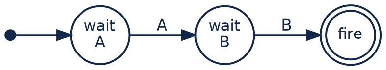
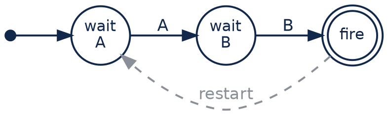
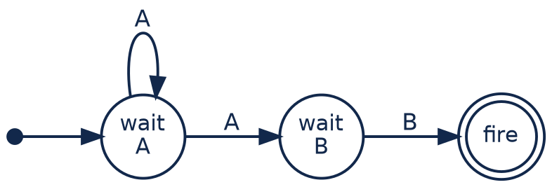
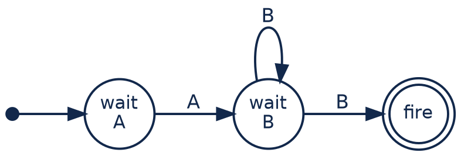
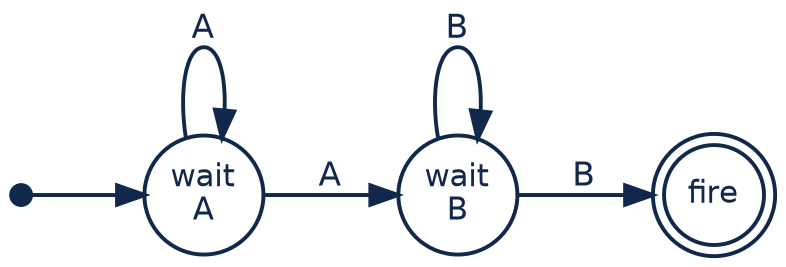
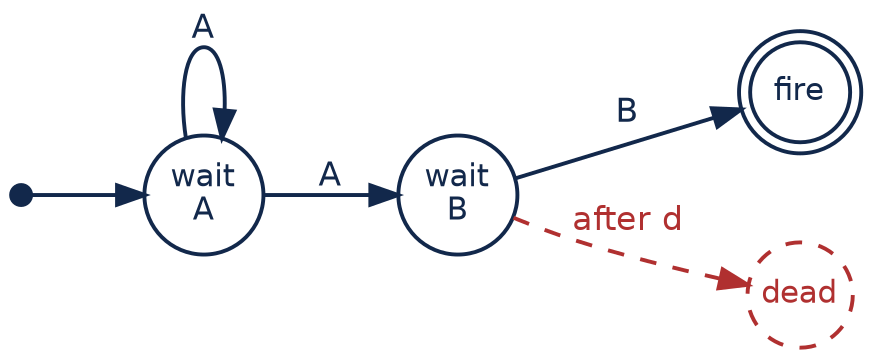
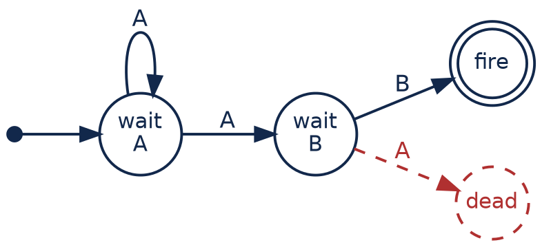

# EPL — `every`, pattern guards, and where the brackets go

*by [Emanuele Della Valle](https://emanueledellavalle.org/) and
[Claude](https://claude.com/product/overview)*

## Introduction

The [fire alarm module](https://github.com/Streaming-Data-Analytics/Courseware/tree/main/Streaming%20Data%20Engineering/EPL/epl_firealarm)
ends by answering its running example with a pattern, and it stops there — at `Q.5.8`. It
uses `->`, one `every` and one guard, and it never asks what those two operators actually do,
because a case study is a bad place to ask. This module asks.

It is deliberately **abstract**: three event types called `A`, `B` and `C`, one integer each,
so that nothing in the example competes with the shape of the thing being taught. Two
questions, and they are the two questions people get wrong in production:

> **How many times does a pattern match, and how many copies of it are alive at once?**
> That is `every`, and the answer depends on *where you put it*.

> **How does a pattern give up?** That is a **guard**, and there are two kinds — one that
> watches the clock and one that watches the stream.

The queries continue the lecture-5 numbering of the fire alarm module, from `Q.5.9`, so the
two files can be read as one lecture. The last section is an **annex** on operator precedence:
it matters, it costs matches, and it is the wrong thing to open with.

## Resources

* [espertech](https://www.espertech.com)
* [EPL documentation](http://esper.espertech.com/release-9.0.0/reference-esper/html_single/)
* [online environment to try EPL](http://esper-epl-tryout.appspot.com/epltryout/mainform.html)

Behind the drawings in the next section, for anyone who wants the formal version:

* Agrawal, Diao, Gyllstrom, Immerman,
  [*Efficient Pattern Matching over Event Streams*](https://people.cs.umass.edu/~immerman/pub/sase+sigmod08.pdf),
  SIGMOD 2008 — the **NFA^b** model: a non-deterministic automaton plus a match buffer
* Giatrakos, Alevizos, Artikis, Deligiannakis, Garofalakis,
  [*Complex event recognition in the Big Data era: a survey*](https://link.springer.com/article/10.1007/s00778-019-00557-w),
  VLDB Journal 2020 — including the automata-based and the Petri-net-based families

## A pattern is a machine; a match is a token running through it

Everything below is easier if you carry one picture, and the picture has **two halves that
must be kept apart**.

The **machine** is the shape of the pattern: a place to start, one edge per operand, one
accepting place. It is drawn once and it never changes — it is what you wrote.

The **tokens** are what runs on it. A token is one partial match in progress: it sits on a
place, and it carries **its own bindings** for `x`, `y`, `z` and its own clock. Every arriving
event is offered to every token. A token that reaches the accepting place **fires** — it emits
one row, made of the bindings it was carrying, and it is gone.

*Token* and **instance** mean the same thing below; the first is the better word when what
matters is how many are on the board, the second when what matters is what one of them is
doing.

Keep those apart and the whole module is three sentences.

**1. A pattern with no `every` puts exactly one token on the board.**



It advances, fires, and there is nothing left. Nothing puts a second token down, so the second
`A` in the stream arrives to find an empty board. You have met this already: it is the same
distinction as `output first` in lecture 4 — speak once, then never again.

**2. `every` is a self-loop, and a self-loop is a token factory — so where you put the loop
decides how many tokens are on the board at once.**

Taking a self-loop means: **put a new token down without picking up the one that was there**.
Put the loop around the whole pattern and there is one token at a time, replaced after each
match. Put it on the first operand and every `A` drops a token, all waiting together. Put it
on the second and one token sits there re-arming for ever. Put it on both and you get every
token you can have. The four variants of section 1 are those four placements and nothing else.

**3. A guard is an edge that removes a token from the board** — and it produces no output.

There are exactly two kinds, and the difference is what is written on the edge:

| guard | the edge is labelled | it can see | it cannot see |
|---|---|---|---|
| `where timer:within(d)` | **a clock** — *d has elapsed* | time passing | events |
| `and not A` | **an event** — *an `A` arrived* | events | time passing |

That is the whole difference, and section 2 measures it.

**The alphabet of the drawings**, used consistently in all seven:

| symbol | meaning |
|---|---|
| filled dot | where a token is put down |
| plain circle | a place a token can wait on |
| double circle | the accepting place: a token that gets here emits a row and is gone |
| dashed red circle | where the engine takes a token off the board — **silently** |
| self-loop | an `every`: the edge that puts down a token without picking one up |
| dashed grey edge | a token replaced after a match, not a transition on an event |

Count the loops, and count where they sit. The row counts follow. Nothing below needs to be
memorised.

### What a pattern is not

The two halves are worth separating because the obvious short version — *a pattern is a
finite-state machine* — is **wrong**, in a way this module runs into on almost every page.

* **Not a deterministic automaton.** A DFA is in one state. Section 1.6 shows one event
  producing three rows from one statement, because three tokens were waiting.
* **Not a plain non-deterministic automaton either.** An NFA is in a *set* of states, which is
  still finite. But the two rows `{2,3}` and `{3,3}` at 08:00:06 come from two tokens **on the
  same place**, told apart only by what they carry. A finite automaton has nowhere to keep
  that: the alphabet here is infinite, because events carry data. You need registers.
* **And the board is not finite-state at all.** In section 1.5 the number of tokens grows with
  the stream. Finitely many places, unboundedly many tokens on them, each carrying data — that
  is a **marking**, not a state, and the distinction is exactly the one between an automaton
  and a Petri net. The last bullet of *Notes and observations* is the operational consequence.

The nearest thing in the literature to what is drawn here is SASE's **NFA^b** — a
non-deterministic automaton *plus a match buffer*, whose runtime is a set of **runs**, each run
carrying a state, a start time and a value vector
([Agrawal, Diao, Gyllstrom and Immerman, SIGMOD 2008](https://people.cs.umass.edu/~immerman/pub/sase+sigmod08.pdf)).
Add clocks for `timer:within` and you are in timed-automaton territory; take the unbounded
multiset of tokens seriously and coloured Petri nets are the natural home, which is why part
of the CEP literature models these languages that way instead
([survey](https://link.springer.com/article/10.1007/s00778-019-00557-w)).

**None of which is a claim about Esper.** The reference documentation describes neither
patterns nor `match_recognize` in terms of a state machine — of `match_recognize` it says only
that it is *"very similar to a regular-expression pattern"*, an analogy rather than a model.
The drawings here are a **model for reasoning about the behaviour**, and they earn their place
by predicting it. Every number in this file comes from a run, never from a drawing.

## Event types

```
create schema A ( n int );
create schema B ( n int );
create schema C ( n int );
```

`C` takes part only in Lab 1, and it is declared here — and in **every** run of this module —
so that the statement ordinals the engine assigns never shift between runs. That is the
lesson of `stmt3_pat_0_0` in the fire alarm module: an internal name that moves is an
internal name you cannot cite.

## The trace

Sections 1 and 2 run against the trace below. It is short enough to hold in your head, which
is the point: eight events, four `A` and four `B`, arranged so that all four `every` variants
give different answers.

```
A={n=1}
t=t.plus(1 seconds)
B={n=1}
t=t.plus(2 seconds)
B={n=2}
t=t.plus(1 seconds)
A={n=2}
t=t.plus(1 seconds)
A={n=3}
t=t.plus(1 seconds)
B={n=3}
t=t.plus(1 seconds)
A={n=4}
t=t.plus(1 seconds)
B={n=4}
t=t.plus(5 seconds)
t=t.plus(5 seconds)
```

Events at t = 0, 1, 3, 4, 5, 6, 7, 8 — so `A1 B1 B2 A2 A3 B3 A4 B4`. Then the clock runs on
to 08:00:18 with nothing happening.

**Those two silent advances at the end are not padding**, and they are the one change made to
this trace. In lecture 3 a trace that stopped at the last event hid every expiry; here they
answer a different question, and by producing *nothing at all* they answer it: an unguarded
pattern has no scheduled work. It is driven entirely by arrivals. A guard is precisely the
thing that puts a pattern on the clock — and section 2 shows that the clock's work, when it
comes, is invisible.

The two later sections bring their own traces, given where they start, because the trace
above is a good *teaching* trace and a poor *discriminating* one. Those are different jobs
and section 2.4 is where the difference becomes concrete.

## How to read the outputs in this file

Every result below was produced on the
[online tool](http://esper-epl-tryout.appspot.com/epltryout/mainform.html) and pasted back;
nothing is asserted from reading a query. The tool prints one block per instant at which
anything happened:

```
* At: <timestamp>
   * Statement: <the @name of the statement that produced these rows>
      * Insert
         * <one line per row>
```

Two things about that shape carry information in this module:

* **the number of rows under one `Statement:` at one instant is the number of tokens that just
  reached the accepting place.** In lecture 3 several rows at one instant meant several
  dispatches; here it means several partial matches completing together, and section 1.6 is
  built on it;
* **a statement that produces no block at all is saying something.** Every silence below is
  load-bearing, and each one is named where it occurs.

Where two queries are shown together they were deployed in the **same run**, against the same
trace, and the transcript is filtered to the statements under discussion. Nothing is
reordered and no row is retyped: every transcript in this file was extracted by script from
a recorded run, and every statement was generated from the same source as
`everyandguard.epl`.

**One honest caveat.** `Q.5.10bis` is the only statement in this file that was **not executed
in this pass**; it is carried over from the previous version of the module, and it is flagged
where it appears.

---

# 1. `every` — where you put the loop

## 1.1 With and without the loop

Start with the smallest possible pair: one operand, and one keyword between the two queries.

```
@name('Q.5.9')
select x.n
from pattern [ x=A ];
```

```
@name('Q.5.10')
select x.n
from pattern [ every x=A ];
```

```
* At: 2001-01-01 08:00:00.000
   * Statement: Q.5.9
      * Insert
         * Q.5.9-output={x.n=1}
   * Statement: Q.5.10
      * Insert
         * Q.5.10-output={x.n=1}
* At: 2001-01-01 08:00:04.000
   * Statement: Q.5.10
      * Insert
         * Q.5.10-output={x.n=2}
* At: 2001-01-01 08:00:05.000
   * Statement: Q.5.10
      * Insert
         * Q.5.10-output={x.n=3}
* At: 2001-01-01 08:00:07.000
   * Statement: Q.5.10
      * Insert
         * Q.5.10-output={x.n=4}
```

`Q.5.9` has **one** entry, at 08:00:00, and then nothing — not an empty body, no entry at all,
in any of the three blocks that follow. Its machine had no loop, it fired on `A1`, and it was
gone before `A2` arrived. `Q.5.10` has **four**, one per `A`, each at the instant that `A`
arrived.

This is also the smallest statement of what continuous semantics means. `every x=A` says
*every A, forever*, which is exactly what a `select` off a stream says:

```
@name('Q.5.10bis')
select n
from A;
```

> **Not executed in this pass.** The claim that `Q.5.10bis` and `Q.5.10` agree is inherited
> from the earlier version of this module. The *shape* is verified elsewhere — `Q.3.1` in the
> fire alarm module is a plain `select` off a stream and produces exactly one row per arrival,
> at the arrival instant — but the two statements have not been run side by side here.

## 1.2 `every ( A -> B )` — one instance at a time

The loop goes around the whole pattern. An instance runs from `A` to `B`; when it fires, a
fresh one starts. There is never more than one.



```
@name('Q.5.11')
select x.n, y.n
from pattern [ every (x=A -> y=B) ];
```

```
* At: 2001-01-01 08:00:01.000
   * Statement: Q.5.11
      * Insert
         * Q.5.11-output={x.n=1, y.n=1}
* At: 2001-01-01 08:00:06.000
   * Statement: Q.5.11
      * Insert
         * Q.5.11-output={x.n=2, y.n=3}
* At: 2001-01-01 08:00:08.000
   * Statement: Q.5.11
      * Insert
         * Q.5.11-output={x.n=4, y.n=4}
```

**Three matches: {1,1}, {2,3}, {4,4}.** Follow the single instance through the trace and every
one of them, and every gap, is forced:

| t | event | the instance | why |
|---|---|---|---|
| 0 | `A1` | waiting for `A` → waiting for `B` | |
| 1 | `B1` | **fires {1,1}**, restarts, waiting for `A` | |
| 3 | `B2` | ignored | it is waiting for an `A`, not a `B` |
| 4 | `A2` | waiting for `B` | |
| 5 | `A3` | **ignored** | the instance is already past its `A` edge, and the loop is outside it |
| 6 | `B3` | **fires {2,3}**, restarts | |
| 7 | `A4` | waiting for `B` | |
| 8 | `B4` | **fires {4,4}** | |

`A3` is thrown away, and that is not a defect — it is what this form is *for*. Read it as a
domain question and it becomes obvious: *every time the machine completes a cycle, report it*.
While a cycle is in progress you are not interested in another one starting.

## 1.3 `every A -> B` — one instance per `A`

Move the loop onto the first operand. Now each `A` spawns its own instance, and they wait
together.



```
@name('Q.5.12')
select x.n, y.n
from pattern [ every x=A -> y=B ];
```

```
* At: 2001-01-01 08:00:01.000
   * Statement: Q.5.12
      * Insert
         * Q.5.12-output={x.n=1, y.n=1}
* At: 2001-01-01 08:00:06.000
   * Statement: Q.5.12
      * Insert
         * Q.5.12-output={x.n=2, y.n=3}
         * Q.5.12-output={x.n=3, y.n=3}
* At: 2001-01-01 08:00:08.000
   * Statement: Q.5.12
      * Insert
         * Q.5.12-output={x.n=4, y.n=4}
```

**Four matches**, and the block at 08:00:06 has **two rows**:

```
   * Statement: Q.5.12
      * Insert
         * Q.5.12-output={x.n=2, y.n=3}
         * Q.5.12-output={x.n=3, y.n=3}
```

`A2` at t=4 and `A3` at t=5 each started an instance, both were waiting for a `B`, and `B3`
at t=6 satisfied **both**. One event, two instances, two rows, one instant. Compare the same
instant in `Q.5.11` above: one row, because there was only ever one instance to satisfy.

**A note on the brackets, and it is a deduction rather than a reading.** The earlier version
of this module wrote this query as `(every x=A) -> y=B` and said the brackets do not matter.
They do not, and the two transcripts above prove it: `every x=A -> y=B` produces four matches
including `{3,3}`, while `every (x=A -> y=B)` produces three and does not. There are only two
ways to parse the unbracketed form, and it is measurably not the second — so it is the first.
`every` binds to the operand on its right, not to the sequence. The annex takes this up
properly for the guard, where the same rule costs a match.

## 1.4 `A -> every B` — one instance, re-arming

Move the loop to the *second* operand instead, and leave the first bare.



```
@name('Q.5.13')
select x.n, y.n
from pattern [ x=A -> every y=B ];
```

```
* At: 2001-01-01 08:00:01.000
   * Statement: Q.5.13
      * Insert
         * Q.5.13-output={x.n=1, y.n=1}
* At: 2001-01-01 08:00:03.000
   * Statement: Q.5.13
      * Insert
         * Q.5.13-output={x.n=1, y.n=2}
* At: 2001-01-01 08:00:06.000
   * Statement: Q.5.13
      * Insert
         * Q.5.13-output={x.n=1, y.n=3}
* At: 2001-01-01 08:00:08.000
   * Statement: Q.5.13
      * Insert
         * Q.5.13-output={x.n=1, y.n=4}
```

**Four matches, and `x.n` is 1 in all four.** There is one instance, ever: the outer `A` has
no loop, so `A1` starts the only machine there will be, and `A2`, `A3` and `A4` fall on
nothing. What loops is the *`B` side*: having matched a `B`, the instance re-arms and waits
for the next one.

So `Q.5.12` and `Q.5.13` both report four matches on this trace, and they are not remotely
the same query. One reports four different `A`s, each with its own `B`; the other reports one
`A` four times. **Equal counts are not agreement** — a habit worth forming now, because this
module contains three pairs that agree for three different reasons and only one of them is
agreement by rule.

## 1.5 `every A -> every B` — the temporal cross join

Loops on both.



```
@name('Q.5.14')
select x.n, y.n
from pattern [ every x=A -> every y=B ];
```

```
* At: 2001-01-01 08:00:01.000
   * Statement: Q.5.14
      * Insert
         * Q.5.14-output={x.n=1, y.n=1}
* At: 2001-01-01 08:00:03.000
   * Statement: Q.5.14
      * Insert
         * Q.5.14-output={x.n=1, y.n=2}
* At: 2001-01-01 08:00:06.000
   * Statement: Q.5.14
      * Insert
         * Q.5.14-output={x.n=1, y.n=3}
         * Q.5.14-output={x.n=2, y.n=3}
         * Q.5.14-output={x.n=3, y.n=3}
* At: 2001-01-01 08:00:08.000
   * Statement: Q.5.14
      * Insert
         * Q.5.14-output={x.n=1, y.n=4}
         * Q.5.14-output={x.n=2, y.n=4}
         * Q.5.14-output={x.n=3, y.n=4}
         * Q.5.14-output={x.n=4, y.n=4}
```

**Nine matches**, and they are every `(A, B)` pair in the trace in which the `A` precedes the
`B`:

| | `B1` (t=1) | `B2` (t=3) | `B3` (t=6) | `B4` (t=8) |
|---|---|---|---|---|
| `A1` (t=0) | ✓ | ✓ | ✓ | ✓ |
| `A2` (t=4) | | | ✓ | ✓ |
| `A3` (t=5) | | | ✓ | ✓ |
| `A4` (t=7) | | | | ✓ |

That is a **temporal cross join** between `A` and `B`, with the only constraint that the `B`
must follow the `A`. Four `A`s and four `B`s here; a thousand of each and you get most of a
million rows.

EPL's default fights this — `A -> B` matches the first `A` and the following `B`, once. If
you want to be flooded, **you have to ask for it**, and `every A -> every B` is how you ask.
Writing it by accident is the classic way to bring a running engine to its knees.

## 1.6 One instant, four answers

Here is the block that is worth more than the four sections above it. `B3` arrives at
08:00:06, and the same event reaches four statements deployed in the same run:

```
* At: 2001-01-01 08:00:06.000
   * Statement: Q.5.11
      * Insert
         * Q.5.11-output={x.n=2, y.n=3}
   * Statement: Q.5.12
      * Insert
         * Q.5.12-output={x.n=2, y.n=3}
         * Q.5.12-output={x.n=3, y.n=3}
   * Statement: Q.5.13
      * Insert
         * Q.5.13-output={x.n=1, y.n=3}
   * Statement: Q.5.14
      * Insert
         * Q.5.14-output={x.n=1, y.n=3}
         * Q.5.14-output={x.n=2, y.n=3}
         * Q.5.14-output={x.n=3, y.n=3}
```

| statement | rows | tokens waiting on `B` at that moment | which ones |
|---|---|---|---|
| `Q.5.11` | **1** | 1 | the single token, on its second cycle, put down by `A2` |
| `Q.5.12` | **2** | 2 | `A2`'s and `A3`'s |
| `Q.5.13` | **1** | 1 | `A1`'s, the only one there has ever been |
| `Q.5.14` | **3** | 3 | `A1`'s, `A2`'s and `A3`'s |

**One event, four answers, and each number is the number of tokens on the board.** Nothing
else about the four statements differs — same trace, same instant, same operands, same run.
Only the loops moved.

And notice what `Q.5.14` settles: **three rows, three tokens, one place**. All three were
waiting on the same circle in the same drawing, and they are distinguishable only by the `A`
each is carrying. That is the row that makes *state* the wrong word and *marking* the right
one — see *What a pattern is not*, above.

If a student remembers one thing from this module, this is the block.

## 1.7 The four variants, side by side

Now the whole trace, as a summary. `Q.5.9` is included as the floor: no loop, one match.

| statement | pattern | loops | matches | pairs |
|---|---|---|---|---|
| `Q.5.9` | `x=A` | none | **1** | 1 |
| `Q.5.10` | `every x=A` | on `A` | **4** | 1, 2, 3, 4 |
| `Q.5.11` | `every (x=A -> y=B)` | around the pair | **3** | {1,1} {2,3} {4,4} |
| `Q.5.12` | `every x=A -> y=B` | on `A` | **4** | {1,1} {2,3} {3,3} {4,4} |
| `Q.5.13` | `x=A -> every y=B` | on `B` | **4** | {1,1} {1,2} {1,3} {1,4} |
| `Q.5.14` | `every x=A -> every y=B` | on both | **9** | {1,1} {1,2} {1,3} {2,3} {3,3} {1,4} {2,4} {3,4} {4,4} |

Read the table from the *loops* column and it stops being a table to learn.

---

# 2. Guards — the edge that takes a token off the board

Everything in section 1 is monotone: tokens are put down and they fire. Nothing gives up.
That is unusable in practice — `every x=A -> y=B` will happily pair an `A` with a `B` that
arrives a week later, and in the meantime it keeps the instance, and its bindings, in memory
forever.

A **guard** is the edge that ends an instance without a match. Two kinds.

## 2.1 The two guards, and their control



```
@name('Q.5.15')
select x.n, y.n
from pattern [ every x=A -> (y=B where timer:within(2 seconds)) ];
```



```
@name('Q.5.16')
select x.n, y.n
from pattern [ every x=A -> (y=B and not z=A) ];
```

Both are deployed alongside `Q.5.12` — **unguarded, and identical in every other respect**.
Without it, "the guard cuts something" is an assertion; with it, it is a subtraction you can
point at.

```
* At: 2001-01-01 08:00:01.000
   * Statement: Q.5.12
      * Insert
         * Q.5.12-output={x.n=1, y.n=1}
   * Statement: Q.5.15
      * Insert
         * Q.5.15-output={x.n=1, y.n=1}
   * Statement: Q.5.16
      * Insert
         * Q.5.16-output={x.n=1, y.n=1}
* At: 2001-01-01 08:00:06.000
   * Statement: Q.5.12
      * Insert
         * Q.5.12-output={x.n=2, y.n=3}
         * Q.5.12-output={x.n=3, y.n=3}
   * Statement: Q.5.15
      * Insert
         * Q.5.15-output={x.n=3, y.n=3}
   * Statement: Q.5.16
      * Insert
         * Q.5.16-output={x.n=3, y.n=3}
* At: 2001-01-01 08:00:08.000
   * Statement: Q.5.12
      * Insert
         * Q.5.12-output={x.n=4, y.n=4}
   * Statement: Q.5.15
      * Insert
         * Q.5.15-output={x.n=4, y.n=4}
   * Statement: Q.5.16
      * Insert
         * Q.5.16-output={x.n=4, y.n=4}
```

| statement | guard | matches | pairs | lost |
|---|---|---|---|---|
| `Q.5.12` | none — **the control** | **4** | {1,1} {2,3} {3,3} {4,4} | — |
| `Q.5.15` | `where timer:within(2 seconds)` | **3** | {1,1} {3,3} {4,4} | **{2,3}** |
| `Q.5.16` | `and not z=A` | **3** | {1,1} {3,3} {4,4} | **{2,3}** |

**Each guard removes exactly one match, and it is the same one.** For entirely different
reasons, one second apart:

* `Q.5.15` — `A2` arrives at t=4 and arms a two-second guard, expiring at t=6. `B3` arrives
  at **exactly** t=6. The guard's expiry is a **scheduled callback**, and a scheduled callback
  runs before the events of its own instant — the same rule lecture 3 established for window
  eviction. The instance is torn down a moment before the event it was waiting for reaches it.
* `Q.5.16` — `A2`'s instance never reaches t=6 at all. `A3` arrives at t=5 and `and not z=A`
  kills it there: an **event**, not a clock, and one second earlier.

Note also that `A3` at t=5 does two things at once in `Q.5.16` — it kills `A2`'s instance and
spawns its own, which is why `{3,3}` is still in the output.

**Same output, different instant, different cause.** This is the same trap as `all` against
`snapshot` in lecture 4: two constructs agreeing on one trace, for reasons the output cannot
show. It has to be said out loud, or the pair teaches that `timer:within` and `and not` are
interchangeable. Section 2.4 fixes it properly, with a trace on which they are not.

## 2.2 The brackets that were never doing anything

Write the same guard without its brackets:

```
@name('Q.5.15bis')
select x.n, y.n
from pattern [ every x=A -> y=B where timer:within(2 seconds) ];
```

```
* At: 2001-01-01 08:00:01.000
   * Statement: Q.5.15
      * Insert
         * Q.5.15-output={x.n=1, y.n=1}
   * Statement: Q.5.15bis
      * Insert
         * Q.5.15bis-output={x.n=1, y.n=1}
* At: 2001-01-01 08:00:06.000
   * Statement: Q.5.15
      * Insert
         * Q.5.15-output={x.n=3, y.n=3}
   * Statement: Q.5.15bis
      * Insert
         * Q.5.15bis-output={x.n=3, y.n=3}
* At: 2001-01-01 08:00:08.000
   * Statement: Q.5.15
      * Insert
         * Q.5.15-output={x.n=4, y.n=4}
   * Statement: Q.5.15bis
      * Insert
         * Q.5.15bis-output={x.n=4, y.n=4}
```

**Identical, row for row.** `where timer:within` is a **postfix operator and it binds tighter
than `->`**: it attaches to the operand on its immediate left — the `y=B` — never to the
sequence. So the brackets in `Q.5.15` were documentation, not syntax.

This is the cheapest possible demonstration of the rule — one guard, one operand — which is
why it belongs here rather than in the annex. What it does *not* tell you is what to write
when you actually meant the sequence — and that answer costs a pair of parentheses and
changes everything. It is the annex.

## 2.3 A guard kills silently

Look for the deaths in the transcript above. There are none.

`A2`'s instance ends at 08:00:06 in `Q.5.15` and at 08:00:05 in `Q.5.16`, and **neither
produces a row** — not an empty `Insert`, not a `Remove`, not a `Statement:` line with
nothing under it. There is no block at 08:00:05 at all, and the block at 08:00:06 contains
only matches. The clearer demonstrations are in the two later runs, where the deaths are not
crowded by matches:

* in section 2.4, `Q.5.15` loses `{1,1}` when `A1`'s instance expires at 08:00:04 — and the
  transcript there has **no block at 08:00:04**;
* in Lab 2, the one reading in the trace that is an actual fire produces **nothing at all**,
  because its instance dies at 08:00:14 with no return below 50 — and again, no block.

Set this against lecture 3, and notice that it is the exact mirror image. There, clock-driven
work is what produces the rows nobody expects: a window evicts on a schedule and the average
changes with no new reading. Here, the clock's work produces **nothing** — a guard puts the
pattern on the clock, and then everything the clock does is invisible.

Which is the second reason the control belongs on the slide. Without `Q.5.12` beside it, the
missing `{2,3}` is not a fact a student can see. It is an absence, and absences do not
announce themselves.

## 2.4 A trace built to tell the two guards apart

Section 2.1 left the two guards producing identical output, which proves nothing whatever
about the difference between them. The fix is not more explanation, it is a **better trace**.

Design it from the table in *Patterns are automata*: `timer:within` sees elapsed time and not
events; `and not` sees events and not elapsed time. So the trace needs one configuration of
each kind — and it needs **both**, because one direction alone would leave `and not` looking
merely more permissive.

| configuration | events | what it isolates |
|---|---|---|
| a long wait, nothing in between | `A1` at t=0, `B1` at t=10 | the clock runs out; **no** intervening `A` |
| a quick interruption | `A2` at t=20, `A3` at t=21, `B2` at t=22 | an `A` intervenes; the clock **never** runs out |

```
A={n=1}
t=t.plus(10 seconds)
B={n=1}
t=t.plus(10 seconds)
A={n=2}
t=t.plus(1 seconds)
A={n=3}
t=t.plus(1 seconds)
B={n=2}
t=t.plus(5 seconds)
t=t.plus(5 seconds)
```

The guard is **4 seconds** for this run rather than the 2 above. With 2, `B2` would land
exactly on a guard boundary and the result would turn on the callback-before-events rule of
section 2.1 instead of on the distinction being taught. Choosing a parameter so that *one*
mechanism is being measured is most of what designing a trace is.

```
* At: 2001-01-01 08:00:10.000
   * Statement: Q.5.12
      * Insert
         * Q.5.12-output={x.n=1, y.n=1}
   * Statement: Q.5.16
      * Insert
         * Q.5.16-output={x.n=1, y.n=1}
* At: 2001-01-01 08:00:22.000
   * Statement: Q.5.12
      * Insert
         * Q.5.12-output={x.n=2, y.n=2}
         * Q.5.12-output={x.n=3, y.n=2}
   * Statement: Q.5.15
      * Insert
         * Q.5.15-output={x.n=2, y.n=2}
         * Q.5.15-output={x.n=3, y.n=2}
   * Statement: Q.5.16
      * Insert
         * Q.5.16-output={x.n=3, y.n=2}
```

| statement | matches | pairs | what it lost |
|---|---|---|---|
| `Q.5.12` — the control | **3** | {1,1} {2,2} {3,2} | — |
| `Q.5.15` — `timer:within(4 seconds)` | **2** | {2,2} {3,2} | **{1,1}** — ten seconds elapsed |
| `Q.5.16` — `and not z=A` | **2** | {1,1} {3,2} | **{2,2}** — `A3` intervened |

**The counts are equal and the rows are not.** That is the shape a discriminating trace
should have: a difference in count alone would invite the reading that one guard is simply
stricter than the other.

* `Q.5.15` keeps `{2,2}`: only two seconds separate `A2` from `B2`, well inside four. It loses
  `{1,1}`: ten seconds is not four.
* `Q.5.16` keeps `{1,1}`: **nothing at all** happens between `A1` and `B1`, so nothing kills
  that instance however long it waits. It loses `{2,2}`: `A3` arrives one second after `A2`
  and ends that instance on the spot.

**A clock guard cannot see events; an event guard cannot see the clock.** The trace in
section 2.1 simply contained no case where those two blindnesses point in different
directions — and the two guards are not interchangeable, they only looked it.

There is a general lesson here worth more than the guards. **A module that shows two queries
side by side is claiming they differ.** If both produce the same rows, the claim is unproven
and the reader has been taught a false equivalence. Name the one parameter the pair turns on,
and exercise it in both directions.

---

## Notes and observations

* **`->` is not "immediately followed by".** Nothing in `A -> B` requires the `B` to be the
  next event. `Q.5.13` pairs `A1` with `B4` seven seconds and three `A`s later. If you meant
  *soon*, a guard is how you say it; if you meant *next*, a guard is not enough and you will
  want `and not` as well.

* **`every` is not a modifier on the pattern, it is a position in it.** The four variants of
  section 1 have the same three tokens and the same operands. Only the placement moved, and
  the answers went 3, 4, 4, 9.

* **A tag inside `not` never binds.** `z=C` in Lab 1 is legal, and `z.n` comes back `(null)`
  on every row — by construction nothing ever matches the `not` operand, so there is nothing
  to project. Worth saying because writing `z=C` looks like it should give you something.

* **Equal counts are not agreement, three times over.** `Q.5.12` and `Q.5.13` both report 4;
  `Q.5.15` and `Q.5.16` both report 3; `Q.5.19` and `Q.5.20` in the annex both report 2. Only
  the last is agreement by *rule* — the other two are agreement by *arithmetic*, and a
  different trace separates them. This module says which is which every time, and that is not
  pedantry: a student who leaves with three false equivalences has learnt something worse than
  nothing.

* **Tokens cost memory, and this is where the machine picture stops being a metaphor.** Every
  token holds its own bindings, and in section 1.5 the count of them grows with the stream:
  each new `A` adds one that never leaves. The *drawing* has three circles no matter how long
  the stream runs — but what the engine is holding is the **multiset of tokens on them**, and
  that has no bound. So `every A -> every B` on a real stream is not a slow query, it is an
  unbounded one, and no amount of looking at the three circles tells you so. This is where
  lecture 5 stops and the question of state and lifecycle starts.

---

## Lab

### Q.5.22 — both guards on one statement

Given this stream:

```
A={n=1}
t=t.plus(1 seconds)
C={n=1}
t=t.plus(1 seconds)
B={n=1}
t=t.plus(1 seconds)
B={n=2}
t=t.plus(1 seconds)
A={n=2}
t=t.plus(1 seconds)
A={n=3}
t=t.plus(1 seconds)
B={n=3}
A={n=4}
t=t.plus(4 seconds)
B={n=4}
t=t.plus(1 seconds)
```

Note a detail of the trace: there is **no clock advance between `B3` and `A4`**, so both
arrive at t=6. Events fall at t = 0, 1, 2, 3, 4, 5, 6, 6, 10.

Write an EPL statement that matches *every `A` followed by (a `B` **and not** a `C`) within
three seconds*.

<details>
<summary>solution</summary>

```
@name('Q.5.22')
select x.n, y.n, z.n
from pattern [
  every x=A -> ( (y=B and not z=C) where timer:within(3 seconds) )
];
```

```
* At: 2001-01-01 08:00:06.000
   * Statement: Q.5.22
      * Insert
         * Q.5.22-output={x.n=2, y.n=3, z.n=(null)}
         * Q.5.22-output={x.n=3, y.n=3, z.n=(null)}
```

**Two matches, and the four `A` instances meet three different fates** — which is why this is
a good exercise for one statement:

| instance | armed to | outcome |
|---|---|---|
| `A1` at t=0 | t=3 | **killed by `C1` at t=1** — the `and not` branch. Without the `C` it would have matched `B1` at t=2 |
| `A2` at t=4 | t=7 | **fires {2,3}** on `B3` at t=6 |
| `A3` at t=5 | t=8 | **fires {3,3}** on the same `B3` — one event, two pending instances again |
| `A4` at t=6 | t=9 | **killed by the clock** — `B4` arrives at t=10, one second late |

Three outcomes, both guards, one statement. And `z.n` is `(null)` on both rows: see the note
above on tags inside `not`.

</details>

### Q.5.23 and Q.5.24 — the same question, two readings

This one leaves the abstract types, and it is the only place in the module that does, because
it needs a domain to make its point. Back to the fire alarm:

```
create schema TemperatureSensorEvent (
  sensor string,
  temperature double
);
```

Lecture 3 counted the fires. This counts **the alarms that resolved themselves** — the spikes
that came back down, which its detector cannot tell from a real fire at the time.

> Report every time a sensor reads above 50 °C and then, **within four seconds**, the same
> sensor reads below 50 °C again.

Given this stream:

```
TemperatureSensorEvent={sensor='S1', temperature=55}
t=t.plus(1 seconds)
TemperatureSensorEvent={sensor='S1', temperature=58}
t=t.plus(1 seconds)
TemperatureSensorEvent={sensor='S2', temperature=30}
t=t.plus(1 seconds)
TemperatureSensorEvent={sensor='S1', temperature=45}
t=t.plus(7 seconds)
TemperatureSensorEvent={sensor='S1', temperature=60}
t=t.plus(10 seconds)
TemperatureSensorEvent={sensor='S3', temperature=70}
t=t.plus(1 seconds)
TemperatureSensorEvent={sensor='S1', temperature=20}
t=t.plus(1 seconds)
TemperatureSensorEvent={sensor='S3', temperature=40}
t=t.plus(5 seconds)
t=t.plus(5 seconds)
```

| events | what they are for |
|---|---|
| 55 and 58 at `S1`, t=0 and t=1, then 45 at t=3 | **two spikes, one return** — this is what separates the two answers |
| 30 at `S2`, t=2 | noise: below 50, but the wrong sensor |
| 60 at `S1`, t=10 | **a real fire** — it never comes back down |
| 70 at `S3`, t=20, then 40 at t=22 | a clean transient at a third sensor |
| 20 at `S1`, t=21 | noise: below 50, right sensor, but no spike is pending |

Write it. Then write it the *other* way, and decide which one you meant.

<details>
<summary>solution</summary>

```
@name('Q.5.23')
select up.sensor as sensor, up.temperature as peak, down.temperature as back
from pattern [
  every up = TemperatureSensorEvent(temperature > 50)
  -> ( down = TemperatureSensorEvent(temperature < 50, sensor = up.sensor)
       where timer:within(4 seconds) )
];
```

```
@name('Q.5.24')
select up.sensor as sensor, up.temperature as peak, down.temperature as back
from pattern [
  every ( up = TemperatureSensorEvent(temperature > 50)
          -> ( down = TemperatureSensorEvent(temperature < 50, sensor = up.sensor)
               where timer:within(4 seconds) ) )
];
```

```
* At: 2001-01-01 08:00:03.000
   * Statement: Q.5.23
      * Insert
         * Q.5.23-output={sensor='S1', peak=55.0, back=45.0}
         * Q.5.23-output={sensor='S1', peak=58.0, back=45.0}
   * Statement: Q.5.24
      * Insert
         * Q.5.24-output={sensor='S1', peak=55.0, back=45.0}
* At: 2001-01-01 08:00:22.000
   * Statement: Q.5.23
      * Insert
         * Q.5.23-output={sensor='S3', peak=70.0, back=40.0}
   * Statement: Q.5.24
      * Insert
         * Q.5.24-output={sensor='S3', peak=70.0, back=40.0}
```

**`Q.5.23` reports three; `Q.5.24` reports two; the difference is `{58, 45}`** — and
**neither is wrong**. The English question is ambiguous and the two bracketings are its two
readings:

* `every up -> down` counts **the spikes that came back down**. 55 and 58 each found a
  return, and it happened to be the same reading for both.
* `every ( up -> down )` counts **the returns**. One event brought `S1` back below 50, so one
  row.

Which you want depends on whether you are reporting on sensor readings or on incidents. Ask
before you bracket.

Two silences in this transcript are worth as much as the rows. `30 at S2` and `20 at S1` are
both below 50 and neither produces anything — the first is the wrong sensor, the second
arrives when no spike is pending, because `S1`'s died at t=14. And `60 at S1`, the one reading
in the trace that is an **actual fire**, produces nothing at all: it never comes back down,
so its instance expires in silence.

So this query's output is exactly the *complement* of the fire alarm's `Q.5.6`. That one
counts the fires; this one counts what did not become one. **The reading that appears in
neither output is the one still burning.**

</details>

---

## Annex — where the brackets go

This is the operator-precedence section, and it is last on purpose. It matters — it costs
matches, and it is the single most common way a working pattern gets written wrong — but it
is a rule about parsing, and a rule about parsing is a poor way to meet an idea.

Section 2.2 established the rule with one guard on one operand: **`where timer:within` binds
to the operand on its immediate left.** Here it is on a three-event sequence, where the same
guard has four possible homes and each means something different.

### The statements

```
@name('Q.5.17')
select a.n, b.n, c.n
from pattern [ every a=A -> b=B -> c=C ];
```

```
@name('Q.5.18')
select a.n, b.n, c.n
from pattern [ every a=A -> ( b=B -> c=C ) where timer:within(4 seconds) ];
```

```
@name('Q.5.19')
select a.n, b.n, c.n
from pattern [ every a=A -> ( b=B -> c=C where timer:within(4 seconds) ) ];
```

```
@name('Q.5.20')
select a.n, b.n, c.n
from pattern [ every a=A -> b=B -> c=C where timer:within(4 seconds) ];
```

```
@name('Q.5.21')
select a.n, b.n, c.n
from pattern [ every ( a=A -> b=B -> c=C ) where timer:within(4 seconds) ];
```

### The trace

Three passes of `A -> B -> C` with different gaps, and — this turns out to be the whole
design — **two seconds of silence at the head**.

```
t=t.plus(2 seconds)
A={n=1}
t=t.plus(1 seconds)
B={n=1}
t=t.plus(2 seconds)
C={n=1}
t=t.plus(5 seconds)
A={n=2}
t=t.plus(4 seconds)
B={n=2}
t=t.plus(3 seconds)
C={n=2}
t=t.plus(8 seconds)
A={n=3}
t=t.plus(1 seconds)
B={n=3}
t=t.plus(6 seconds)
C={n=3}
t=t.plus(5 seconds)
```

Events at t = 2, 3, 5 / 10, 14, 17 / 25, 26, 32. The guard is 4 seconds throughout.

```
* At: 2001-01-01 08:00:05.000
   * Statement: Q.5.17
      * Insert
         * Q.5.17-output={a.n=1, b.n=1, c.n=1}
   * Statement: Q.5.18
      * Insert
         * Q.5.18-output={a.n=1, b.n=1, c.n=1}
   * Statement: Q.5.19
      * Insert
         * Q.5.19-output={a.n=1, b.n=1, c.n=1}
   * Statement: Q.5.20
      * Insert
         * Q.5.20-output={a.n=1, b.n=1, c.n=1}
* At: 2001-01-01 08:00:17.000
   * Statement: Q.5.17
      * Insert
         * Q.5.17-output={a.n=2, b.n=2, c.n=2}
   * Statement: Q.5.19
      * Insert
         * Q.5.19-output={a.n=2, b.n=2, c.n=2}
   * Statement: Q.5.20
      * Insert
         * Q.5.20-output={a.n=2, b.n=2, c.n=2}
* At: 2001-01-01 08:00:32.000
   * Statement: Q.5.17
      * Insert
         * Q.5.17-output={a.n=3, b.n=3, c.n=3}
```

### What each one means

| statement | the guard sits | armed when | pass 1 (2, 3, 5) | pass 2 (10, 14, 17) | pass 3 (25, 26, 32) | total |
|---|---|---|---|---|---|---|
| `Q.5.17` | nowhere — the control | — | ✓ | ✓ | ✓ | **3** |
| `Q.5.18` | around `( B -> C )` | `A` matches | `C` by 6 → ✓ | `C` by 14 → ✗ | `C` by 29 → ✗ | **1** |
| `Q.5.19` | around `C` alone | `B` matches | `C` by 7 → ✓ | `C` by 18 → ✓ | `C` by 30 → ✗ | **2** |
| `Q.5.20` | the same, **no brackets** | `B` matches | ✓ | ✓ | ✗ | **2** |
| `Q.5.21` | around the whole group | the **instance** starts | ✗ | ✗ | ✗ | **0** |

Four things come out of that table.

**1. `Q.5.20` is `Q.5.19`.** No brackets at all, and it is identical row for row to the
version bracketed around `C` alone. Writing `A -> B -> C where timer:within(4 seconds)` and
expecting the whole chain to be constrained is the mistake this annex exists to prevent. It
is the fourth independent confirmation of the rule in this course — section 2.2 above,
`Q.5.7` in the fire alarm module, and `epl_where-timer-within-semantics` on the robotic arm
are the others.

**2. Pass 2 is the row that does the work.** `A` at 10, `B` at 14, `C` at 17. `Q.5.18` armed
at `A` and wanted `C` by 14; `Q.5.19` armed at `B` and wanted it by 18. `C` arrives at 17 —
in the gap between the two deadlines. One event separates the two bracketings, and it took
designing the trace to put it there.

**3. `Q.5.21` matches nothing.** It was deployed in this run alongside the other four and it
appears **nowhere in the transcript above** — not once, at any instant. On a trace where the
unguarded control matches three times,
including a first pass whose three events span only three seconds. It is not "the same query
with wider brackets": `every ( (A -> B -> C) where timer:within(4 seconds) )` arms its guard
when the **instance** starts, which under `every` means at engine time zero and then every
four seconds thereafter, for the whole trace. Its instance is born at 0, dies at 4, and
`C1` arrives at 5.

So the difference between `Q.5.18` and `Q.5.21` is where one pair of parentheses goes, and
the difference in behaviour is **one match against none**.

**4. And that separation is what the two seconds of silence bought.** Run against a trace
whose first event is at t=0, `Q.5.18` and `Q.5.21` are indistinguishable — armed *when `A`
matches* and armed *when the instance starts* are the same moment, so they agree, and a
reader concludes the brackets are cosmetic. Two seconds of silence at the head is the
entire fix. It is the clearest example in this course of a trace that has to be **designed**
rather than written down.

**A caveat on `Q.5.21`, stated rather than hidden.** Its zero is the one number in this file
whose *mechanism* cannot be read off the transcript, only its outcome — because by section
2.3 every one of those restarts dies silently, and a statement that never fires prints
nothing at all. The account above is the explanation that fits; it was predicted before the
run and the run agreed with it. It is still reasoning rather than observation. If you teach
`Q.5.21`, teach it as the form whose behaviour is hardest to predict — which is itself the
argument for writing `Q.5.18` or `Q.5.19` instead.

---

## Acknowledgements

The material this module rewrites — the `A`/`B`/`C` types, the eight-event trace, the four
`every` variants and the two guards — is
[Emanuele Della Valle](https://emanueledellavalle.org/)'s, written for earlier editions of
this course. The hand-drawn automata in the accompanying deck are his too, and the clean
diagrams in `img/` are generated renderings of them.

This rewrite was made by [Emanuele Della Valle](https://emanueledellavalle.org/) and
[Claude](https://claude.com/product/overview), together, and the division of labour is the
reason the numbers can be trusted.

The previous version of this module stated **no expected output at all** — every result above
is new. Emanuele executed every statement on the EPL online tool; Claude designed the runs,
restructured the material and wrote the text. Every transcript was extracted from a recorded
run by script rather than retyped, and every statement was generated from the same source as
`everyandguard.epl`, so the two cannot drift apart. The ground truth is in
`reference/verified-output-lecture5.md`.

The opening section was rewritten once more after that, on the owner's challenge. It had said
*a pattern is a finite-state machine*, which is false and which the module's own transcripts
refute: three rows from one statement at one instant are three tokens on one place, told apart
only by what they carry, and their number grows with the stream. It had also asserted that the
engine "compiles the pattern into a machine" — a claim about an implementation that
EsperTech's documentation nowhere makes. Both are withdrawn. What is left is a model, named as
one, with the literature it comes from cited and the limits of it stated in the section itself.

Three things changed on the evidence. The four `every` tables had never been executed; they
turned out to be **correct, row for row**. Two pairs of queries that the material presented
side by side produced **identical** output, proving nothing about the difference they were
meant to show — sections 2.4 and the annex are new traces designed to separate them, and the
pairs that remain identical are now labelled as identities by rule. And Lab 2, which asked
its question about share prices crossing 100, was recast on the fire alarm: the domain was
superfluous, but two things it tested — both operands of the same event type, and a stream
full of events irrelevant to the pattern — appear nowhere else in the lecture.

Claude's work on this course is sponsored by
[Quantia Consulting](https://www.quantiaconsulting.com/).
